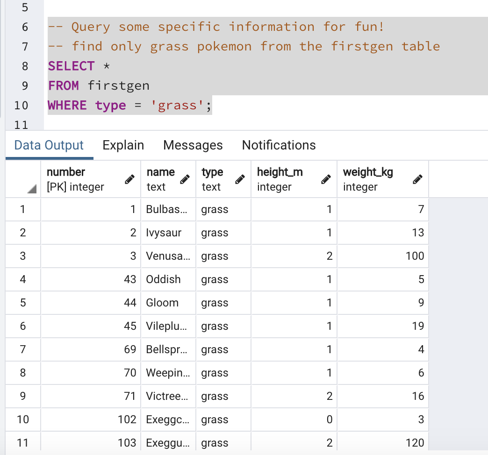
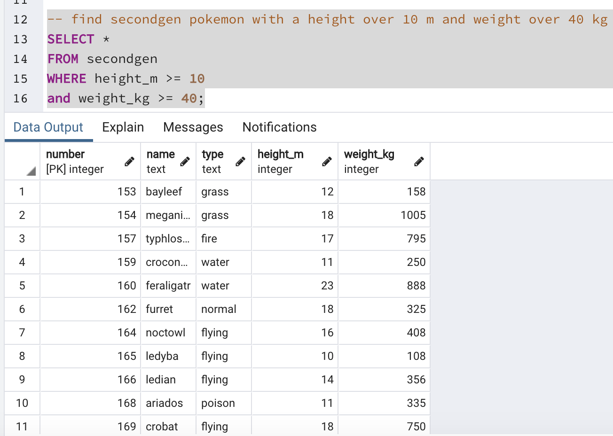

# ETL Pokedex - Project #

* #### EXTRACT ####
    Extracted data on 1st generation Pokemon using a CSV file found on kaggle.  Gathered data on 2nd generation Pokemon with Poke API as a challenge

* #### TRANSFORM ####
    The CSV file had some minor formatting issues, there was a space before every column name that I had to remove, I set the index as the number since every Pokemon has their own unique number, lastly I also renamed columns and only chose a specific few columns that I wanted. The 2nd gen data didn't need any transforming because I formatted it when I pulled the data from the API.

* #### LOAD ####
    I chose to load the data into SQL because the two data sets are in seperate tables and have similar fields. It also allows me to easily query information I want, which would be the main application of this data.  It's a simple Pokedex (Pokemon dictionary) that you can use to find specific pokemon data, in my query file I show a few different things that you can do with the data.

Data Sources

<https://www.kaggle.com/dizzypanda/gen-1-pokemon/data>

<https://pokeapi.co/>
